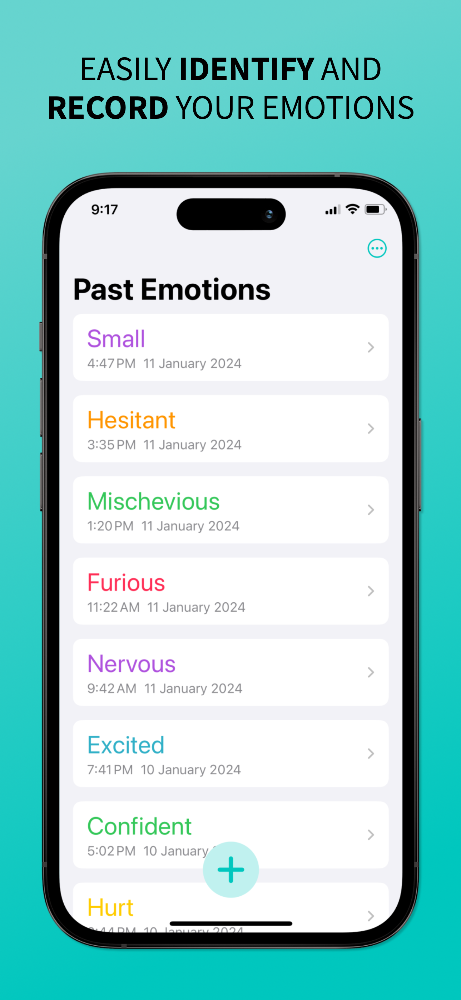
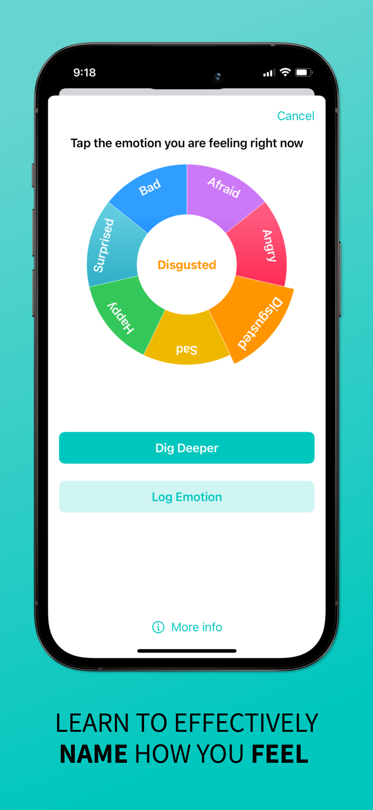
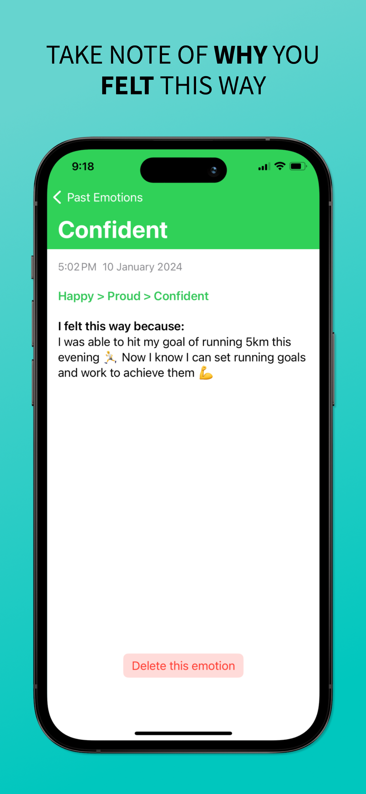
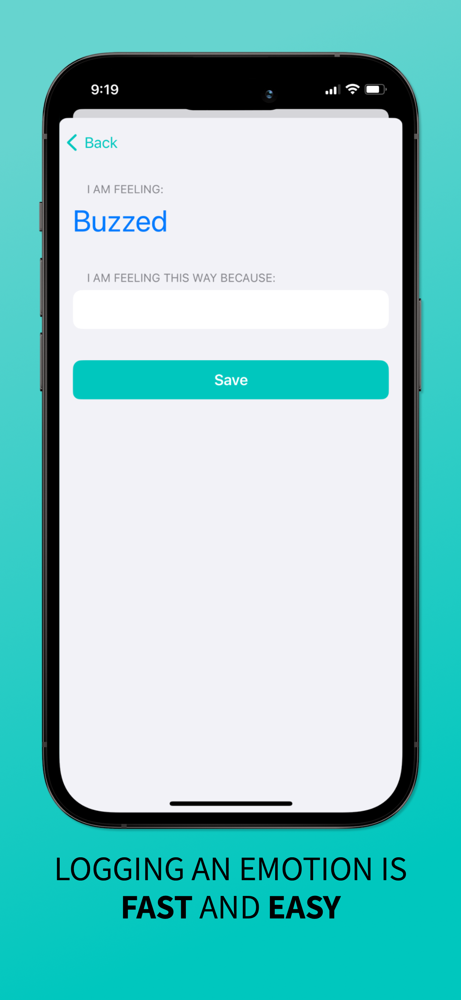
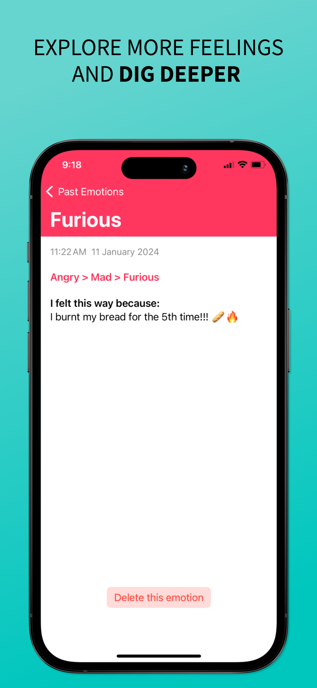

# 🚀 Dig Deeper

> *Built by [Chaotic Good Creations](https://www.chaoticgoodcreations.co) — digital experiences from Aotearoa 🇳🇿.*

---

### 🧭 Overview
Dig Deeper is a daily journaling app that helps you notice, name, and understand your emotions — one reflection at a time.  
It’s designed to build emotional awareness gently through guided prompts and elegant simplicity.

---

### 🖼️ Preview

---

### 🧩 Key Features
- ✏️ Clean, distraction-free daily journaling  
- 💬 Emotion tagging to help you build awareness  
- 🔐 Private and offline-first — your thoughts stay yours  
- ☁️ iCloud sync across your devices  
- 🎯 Gentle reminders to reflect daily  

---

### 🛠️ Tech Stack
| Category | Tools |
|-----------|--------|
| Language / Framework | Swift · SwiftUI |
| Platform | iOS 17 + |
| Data | CoreData |
| Design | Figma |
| Dev Tools | Xcode · GitHub |

---

### 📲 Download
🛒 Available on the [App Store →](https://apps.apple.com/app/dig-deeper/id6472387394)

---

### 🧠 Development Notes
- Designed to encourage micro-journaling habits.  
- Used SwiftUI’s `@FocusState` for smooth text-field flow.  
- CoreData for secure and private records.

---

### 🪄 About Chaotic Good Creations
We design and develop custom apps and websites that balance creativity, usability, and fun.  
→ Visit [chaoticgoodcreations.co](https://www.chaoticgoodcreations.co) to see more.

> *Built beautifully, a little chaotically, and always for good.*
